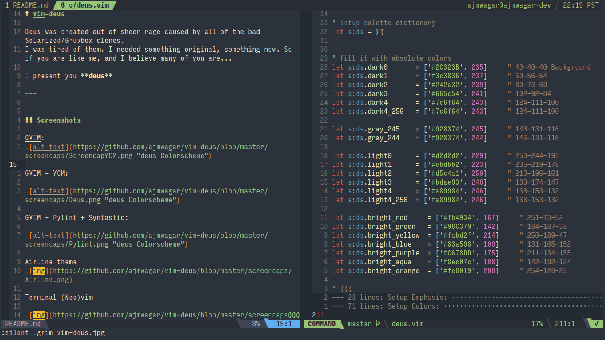
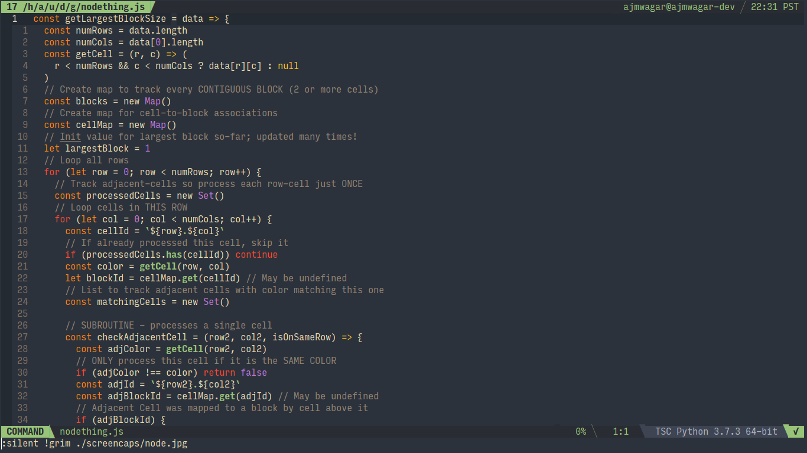
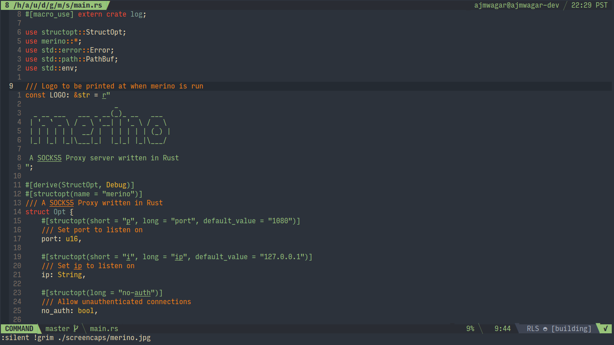

# vim-deus

Deus was created out of sheer rage caused by all of the bad Solarized/Gruvbox clones. (No offense)
I was tired of them. I needed something original, something new. So if you are like me, and I believe many of you are...

I present you **Deus**:

## Screenshots

</img>

</img>

</img>

---

## Installation

Manual: 
1. download & place `deus.vim` in your `vimfiles/colors` folder (usually `~/.vim/colors/`)
2. add this line to your `.vimrc`

`colors deus`

**OR**

Use a package manager like Pathogen, Vundle, or Vim-plug just to name a few:

### Pathogen:

Run this in your terminal

```bash

cd ~/.vim/

mkdir bundle

cd bundle

git clone https://github.com/ajmwagar/vim-deus.git
```

### Vim-Plug:

Add the following lines to your `~/.vimrc`:

```vim
call plug#begin('~/.vim/bundle/')
Plug 'ajmwagar/vim-deus'
cal  plug#end()
```

Don't forget to run:

`:PlugInstall`


---

## Language Syntax Support:

- Lua
- Go
- **JavaScript** 
- **CSS/HTML**
- PHP
- **C#**
- JSON
- **Markdown**
- Haskell
- Scala
- Elixir
- Java
- MoonScript
- Objective C
- C Languages
- CoffeeScript
- **Ruby**
- **Rust**
- **Python**
- Clojure
- XML
- Any many more... (try [vim-polyglot](https://github.com/sheerun/vim-polyglot) for syntax packs)

**Bold** = really nice looking (They all look good but these are my personal favorites.)

---

## Plugin support

- Airline `:AirlineTheme deus`
- coc.nvim (popup-windows & error colors)
- Ctrlp
- FZF
- NerdTREE
- Syntastic (and most linters)
- Deoplete
- YCM (YouCompleteMe)
- Tabbar
- Vim-easy-motion
- Sneak
- Rainbow-Parentheses

---

## Palette

| Color                                                  | Hex     | Use           |
|--------------------------------------------------------|---------|---------------|
|</img>| #eaeaea | foreground    |
|</img>| #2c323b | background    |
|</img>| #ffffff | white         |
|</img>| #000000 | black         |
|</img>| #d54e53 | red           |
|</img>| #98c379 | green         |
|</img>| #e5c07b | yellow        |
|</img>| #83a598 | teal          |
|</img>| #c678dd | purple        |
|</img>| #70c0ba | bright teal   |
|</img>| #666666 | gray          |
|</img>| #ec3e45 | bright red    |
|</img>| #90c966 | bright green  |
|</img>| #edbf69 | bright yellow |
|</img>| #2bcec2 | bright blue   |
|</img>| #c858e9 | bright purple |


## Troubleshooting

When using terminal-vim and vim-deus the colors
can get messed up.

To fix this add the following snippet to your `~/.vimrc`:

```vim
set t_Co=256
set termguicolors

let &t_8f = "\<Esc>[38;2;%lu;%lu;%lum"
let &t_8b = "\<Esc>[48;2;%lu;%lu;%lum"

set background=dark    " Setting dark mode
colorscheme deus
let g:deus_termcolors=256
```

### Tmux

Instructions on how to enable TrueColor for Tmux can be found [here](https://gist.github.com/parmort/4d95555b3f9435fa953f0b7c67c86e8f).

### Italics

If you use vim in a terminal that supports italics, set the environment variable `TERM_ITALICS` to TRUE (i.e. `export TERM_ITALICS=true`) to enable with vim-deus.

---

## Thank You
I took **a lot** of inspiration from two great colorschemes, 
[Onedark](https://github.com/joshdick/onedark.vim) and
[Gruvbox](https://github.com/morhetz/gruvbox). I want to thank their creators for making such great
color schemes. So thank you!
